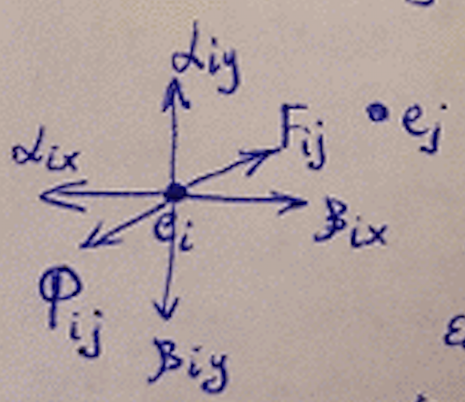
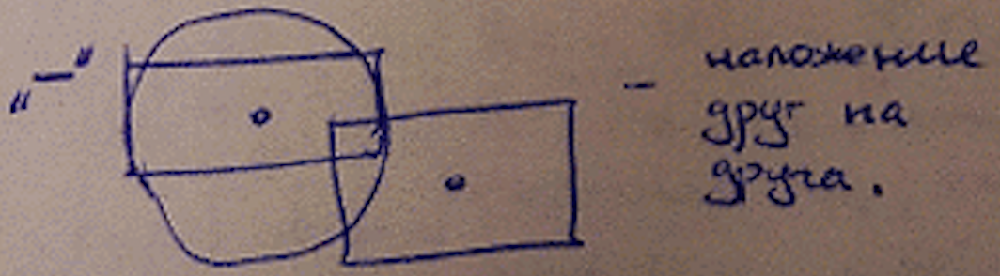

___
# Вопрос 10: Непрерывно-дискретные методы размещения элементов
___

Данные методы работают в непрерывном монтажном поле, т.е. сетка позиций необязательна. Если сетка позиций задана, то задача решается в два этапа:

1. Элементы размещаются на непрерывном монтажном поле;
2. Сдвиг на фиксированную позицию.

Эти методы сводят задачу размещения к решению системы дифференциальных уравнений:

$$ L = \frac{1}{2} \sum_{i}^{} \sum_{j}^{} r_{ij} * d_{p(i) p(j)}, d_{p(i) p(j)} = F(x_i, y_i, x_j, y_j) $$

$$ \frac{\partial L}{\partial x_i} = 0, \frac{\partial L}{\delta y_i}, i = 1 \div n $$

## Алгоритм на основе силовых функций

Вершины графа представлены как системы материальных точек, на которые действуют силы притяжения или отталкивания. Тогда решением задачи будет такое положение точек, при котором наступает состояние динамического уравновешивания.

$$ F_{ij} $$ – сила притяжения. $$ F_{ij} = K_F * r_{ij} * d_{p(i) p(j)} $$

Чем больше расстояние между точками, тем сила больше, и чем больше рёбер, тем сила больше.

$$ \Phi_{ij} $$ – сила отталкивания. $$ \Phi = K_\Phi * \frac{1}{d_{p(i) p(j)}} $$

Если связей между элементами нет, то сила отсутствует.

$$ \alpha_{iy}, \beta_{iy}, \alpha_{ix}, \beta{ix} – силы притяжения и отталкивания от границ монтажного поля.  $$

### Система уравнений:

$$ \begin{cases} F_{x_{ij}} + \Phi_{x_{ij}} + \alpha_{ix} + \beta{ix} = 0 \\ F_{y_{ij}} + \Phi_{y_{ij}} + \alpha_{iy} + \beta_{iy} = 0 \\ i \ne j; i, j = 1 \div n $$

