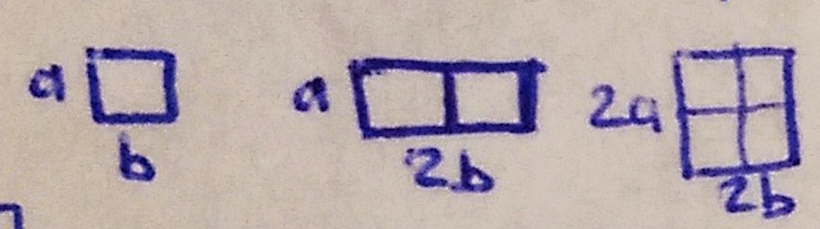
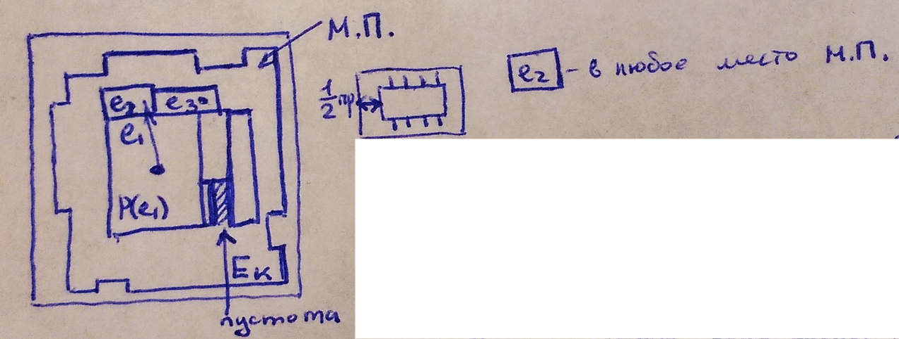

___
# Вопрос 11: Методы размещения разногабаритных элементов на монтажном поле
___

## Размещение на непрерывном монтажном поле

Одна или несколько позиций будут заняты

### При размещении разногабаритных элементов может быть использован алгоритм плотного размещения:

#### Постановка:
монтажное поле, напр. ... м.п., модель – взвешенный граф схемы.

#### Критерий:
минимальная длина соединений, нет директивно размещённых элементов.

Плотное размещение – устанавливаем не реальные, а увеличенные размеры. Для установки элементов в алгоритме плотного размещения привязываются к угловым точкам занятой части монтажного поля.
При этом выбирается тот угол, который находится ближе к центру масс. При установке 3-го элемента мы имеем возможность установить центр масс.

При размещении учитывается не только связность элементов.

В качестве очередного размещаемого элемента выбирается такой элемент, при котором функционал $$ C = C-1 + \gamma C_2 $$ принимает максимальное значение.

$$ C_1 $$ – правило по связности (параметр) – одно из 4-х правил; $$ \gamma $$ – весовой коэффициент, подбирается экспериментально; $$ C_2 = \frac{S_{e_K}}{S_{fpmb}} $$, $$ S_{e_K} $$ – площадь размещаемого элемента, $$ S_{fpmb} $$ – площадь свободной части монтажного поля. Этот коэффициент ($$C_2$$) возрастает. При размещении первого элемента $$C_2$$ мало' $$\rightarrow$$ основное влияние оказывает $$C_1$$, ближе к концу основную роль играет $$C_2$$.

Сначала размещаем более крупные элементы, затем более мелкие.
