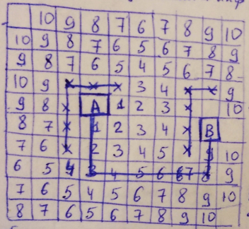
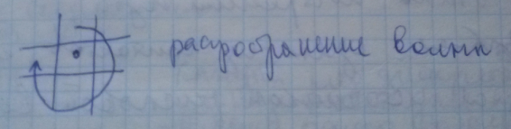

___
# Вопрос 14: Волновые методы трассировки соединений.
___

Необходимо:

  1. Граф комммутационной схемы
  2. Модель монтажного поля

Дискретное рабочее поле (ДПР)

Размер дискрета определяется допустимым расстоянием между осями двух параллельных соединений. Каждый ряд дискретов предназначен для прокладки только одного соединения. Трассировка идёт в пределах одного слоя. На ДПР могут быть области, где трассировка запрещена $$ \rightarrow $$ технологические отверстия, контакты не  задействованы в данном соединении $$ \rightarrow $$ запрещённые дискреты "Х", их использовать нельзя.

**Волновой алгоритм Ли** (развод только двух контактных соединений)

Минус: Большое число дискретов.

Строит соединения в **2 этапа**:

1. Этап распространения числовой волны.

Выбирается один из компонентов, который называется *источником числовой волны*. Второй контакт называют *приёмником числовой волны*.

Из источника распространяется числовая волна во все стороны равномерно. Закон распространения волны зависит от принятого критерия оптимальности: при минимальной длине соединений - числовой вес в ячейке очередного фронта волны на единицу больше, чем числовой вес ячейки предыдущего фронта волны.

Волна распространяется только по свободным дискретам до тех пор пока:

  а) не будет достигнута ячейка-приёмник
  б) нет ни одного свободного дискрета (соединение не построено)

*Закон Гюгенса-Фригеля*: Каждый дискрет волны может приниматься, как источник новой волны.

2. Этап построения пути.

Путь строится от приёмника к источнику. В путь включаются последовательно дискреты с весом на 1 меньше. Если рядом находятся 2 дискрета с одинаковым весом $$ \rightarrow $$ использовать либо правило приоритета (выше), либо следующее правило: Не менять направление движения до тех пор, пока мы не будем вынуждены это сделать. После построения пути дискреты вошедшие в путь заносятся в запрещённые, остальные - обнулить веса и т.д.

Плюс: алгоритм всегда найдёт путь, если он существует.

Минус:
  - Медленный.
  - Т.к. соединения минимальной длины $$ \Rightarrow $$ они близки к запретным зонам $$ \Rightarrow $$ нет возможности проложить рядом другое соединение.
