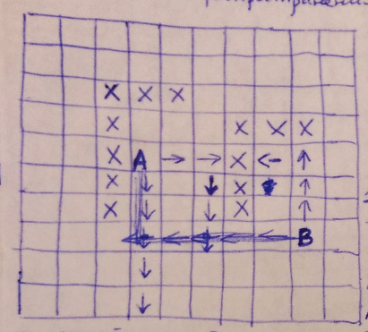
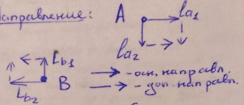

___
# Вопрос 15: Лучевые методы трассировки соединений.
___

## Двулучевой алгоритм

х - преграды, тупики

Этапы:
1. Этап распространения лучей;
2. Этап построения пути;

Направление:

### Этап распространения лучей

Обе точки - источники лучей (по 2 луча)

Луч $$ \approx $$ волна, но распространяется в узко заданном направлении;

Ширина = 1 дискрет;

Основное направление выбирается в направлении второй точки;

Лучи исходящие из одной точки - одноименные;

По дополнительному направлению луч идет в том случае, если нет возможности идти по основному;

Лучи распространяются одновременно: 1 шаг = 1 дискрет;

Лучи распространяются, пока:
1. не пересекутся разноименные лучи;
2. дальнейшее распространение всех лучей не возможно;

### Этап построения пути

Путь от одной точки к другой строится вдоль лучей разноименных точек, которые пересекаются, если пересечения нет, то выбираются дополнительные направления лучей.

"+": Быстрее идет поиск, чем у волнового, Меньше число просматриваемых дискретов;

"-": Эффективность меньше, чем у волнового (может не построить путь, хотя он есть), Большее число изгибов, чем в волновом.

Для выхода из тупика требуется сделать 2 шага назад, повернуть на дополнительное направление и строить число шагов, которое мы отошли назад.