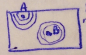
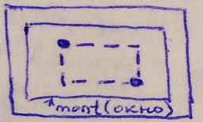
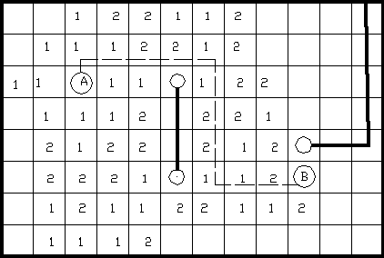
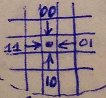
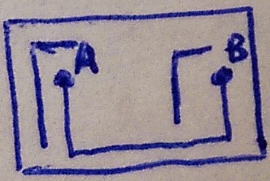
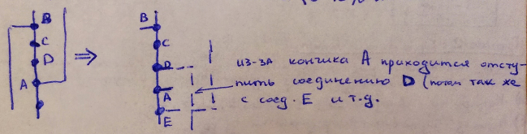

___
# Вопрос 16: Модификации волновых методов трассировки.
___

### Группа 1: Простейшие

1. **Метод встречной волны** - обе точки являются источниками волны.

2. **Метод прямоугольника** - ограничить поле распространения волны прямоугольником (окном), внутри которого находятся соединяемые выводы. Если соединение найти не удалось, то границы окна расширяют.

### Группа 2: Кодирование волны

1. **Кодированиепо модулю 3** - ячейкам в последовательных фронтах присваиваются не сами веса, а их значения по модулю 3: {1, 2, 3}. Если соседними с ячейкой являются одинаковые метки, то используется правило приоритетного направления (например по часовой стрелке).
2. **Метод Акерса** - при распространении волны ячейкам присваиваются значения отметок из заданной последовательности: {1, 1, 2, 2, 1, 1, 2, 2}. Количество разрядов памяти на одну ячейку составляет равно 2. При возможности построения последовательности по нескольким направлениям, выбор совершается согласно приоритету.

3. **Использование путевых координат** - При выборе последовательности ячеек по этому методу для каждой ячейки, в случае соседства по ребрам достаточно знать, от какой соседней ячейки в нее пришла волна: сверху, слева, снизу, справа (задается стрелками)

### Группа 3:
***Критерии:***
1. Минимальное число построений
2. Построение соединений с минимальным числом изгибов

3. Построение соединений, отталкивающихся от запретных зон (по аналогии с морским боем)

4. Построение соединений с использованием нескольких критериев
5. Построение соединений в виде деревьев (дерево Штейнера)

***Дерево Штейнера (min дерево)***
1) Из исходного дерева удаляем ребро (выбрать самим)
2) Удаляем вершины, соединённые удалённым ребром
3) Получили 2 поддерева => перестроить их с целью минимизации суммарной длины рёбер (м.б. через центр масс)
4) Соединить поддеревья кратчайшим образом (ортогональной метрикой)

### Группа 4:
Построение соединений в нескольких слоях: горизонтальные фрагменты в одном слое, вертикальные - в другом.

### Группа 5: Итерационный волновой алгоритм

***Итерация 1***
После разведения соединения стираем его среднюю часть, оставляя только концы (5-10% от контактов)

***Итерация 2***
Повтор трассировки каждого соединения, но оставляем кончики (уже 20-25% от начальных точек)
***Итерация 3***
Окончательное разведение соединений