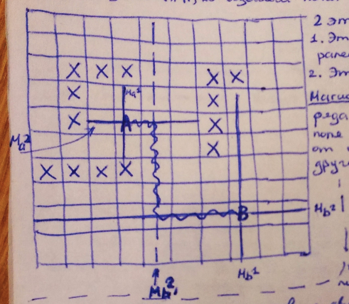

___
# Вопрос 17: Трассировка соединений на основе представления о магистралях.
___

Этапы:
1. Этап построения магистралей;
2. Этап построения пути;

Магистраль - линия, при наличии ряда свободных дискретов рабочего поля по горизонтали или вертикали от одной запретной зоны до другой

## Алгоритм построения малоповоротных путей

### Этап 1

На базе исходных точек строим магистрали 1-ого уровня за счет включения в них свободных дискретов с двух сторон исходных точек.

Если магистрали 1-ого уровня не пересеклись, значит строим магистраль 2-ого уровня, затем 3-ого и так далее. Магистрали каждого следующего уровня строятся перпендикулярно к магистрали каждого предыдущего уровня, используя дискреты магистрали предыдущего уровня.

Построение магистралей продолжается до тех под, пока любые разноименные магистрали не пересекутся или уже негде строить магистрали.

### Этап 2

Построение пути вдоль пересеченных магистралей.

"+": Более высокая скорость решения задачи, но при построении магистралей не очень высокго уровня. Всегда найдется решение.

Надо ограничить уровни магистралей (2-3).