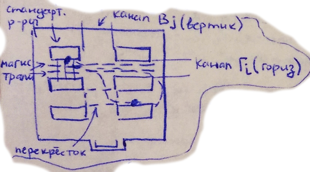
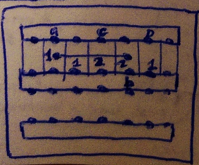
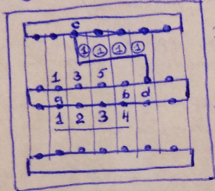
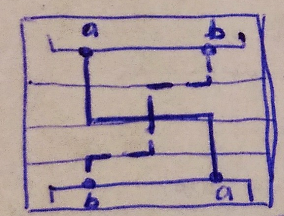
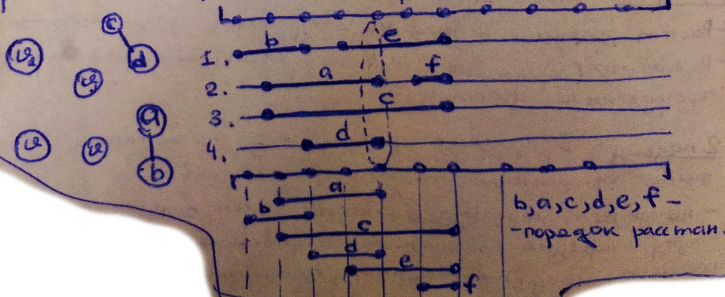
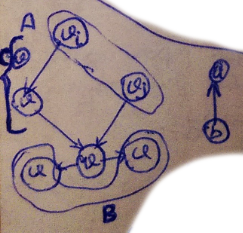
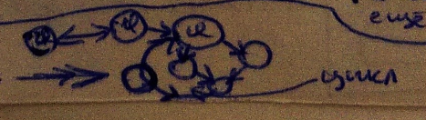

___
# Вопрос 18: Канальные методы трассировки соединений.
___

## 2 этапа:

I. Распределение соединений по каналам (без определения их точной геометрии) - макротрассировка
***Цель:*** Распределение всех соединений по каналам так, чтобы они могли быть все проложены (пропускная способность канала)

II. Определение точной геометрии каждого соединения / распределение соединений по магистралям внутри канала - микротрассировка

**I этап**

***Проблемы:*** Использование лучевых/волновых алгоритмов

**1-й подход: Решение задачи**
- Построения дерева соединений;
- Расчёт загрузки канала на каждом этапе размещения соединений;
- Перепостроение (переназначение) соединений на каналы, которые проходят через перегруженные участки;

***Критерии:*** минимальная длина соединений

**2-й подход: В процессе распределения соединений по каналам необходимо сразу учитывать пропускную способность каналов**

- Нигде нет перегрузов => очень важен порядок трассировки;
- Определение порядка выполнения трассировки, затем решение задачи размещения соединений по каналам, запрещая перегрузки;

**1-й подход:**

Классический метод - вертикальных/горизонтальных соединений в разных слоях, разбив канал на макродискреты. 1 и 2 - это степень перегрузки каждого макродискрета, смотрим длину участка перегруженности, выбираем соединение для изъятия.

**2-й подход:**

Вес: Fn + 1 + загруженность макродискрета.
Здесь пытаемся соединить a и b. Соединение c-d уже проложено. Проходим, пока веса не выровняются, потом продолжать оба канала.

***Проблемы: (при распределении соединений внутри канала)***
1. Горизонтальные ограничения - разнесение горизонтальных соединений;
2. Вертикальные ограничения - разнесения вертикальных соединений;

 оба конца имеют одинаковые коэффициенты по оси X

3. Цикл в графе вертикальных ограничений;
4. Наличие перекрёстков;

### Решение проблем 1 и 2 - граф гориз. / вертикальных ограничений (ГГО и ГВО).

**ГГО:**

**ГВО:**

А - магистрали сверху-вниз; B - магистрали снизу-вверх;
После реализации групп A и B убираем их их графа, в оставшемся графе повторяем процедуру объединения соединений в группы: со входящими и с выходящими рёбрами.

### Решение проблемы 3:

Ввод дополнительных соединений:

### Решение проблемы 4: Перекрёстки

Гоним все соединения до перекрёстка, затем соединяем концы одного соединения алгоритмом (направленным, волновым и т.п.) по подобию с алгоритмом итерационной волновой трассировкой.