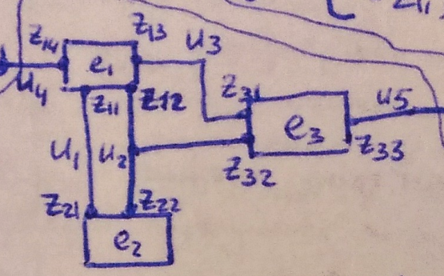
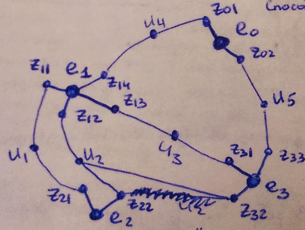
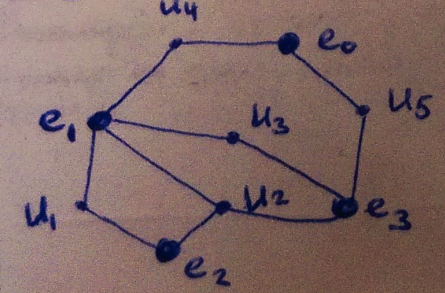
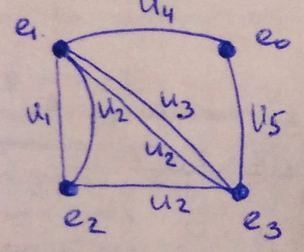
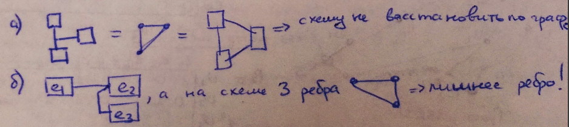

___
# Вопрос 2: Модели схем в задачах автоматизированного конструирования.
___

Модели являются способами представления графа, который строится по схеме.

## Обозначения

$$ E = {e_1, e_2, ..., e_n} $$ - множество элементов

$$ U = {u_1, u_2, ..., u_m} $$ - множество цепей

$$ Z =
\left(\begin{matrix}
    z_{11} & z_{12} & ...    & z_{1n_1} \\
    z_{21} & z_{22} & ...    & z_{2n_2} \\
    \vdots & \vdots & \ddots & \vdots \\
    z_{n1} & z_{n2} & ...    & z_{nn_n}
\end{matrix}\right) $$ - таблица контактов (выводов) элементов

## Модель 1: Граф коммутационной схемы (ГКС)

### Способ описания 1: матрица A и B

$$
A = 
\begin{matrix}
           & z_{11} & ...    & z_{1n_1} & ...    & z_{n1} & ...    & z_{nn_n} \\
    e_1    & 1      & ...    & 0        & ...    & 1      & ...    & 1        \\
    \vdots & \vdots & \vdots & \vdots   & \vdots & \vdots & \vdots & \vdots   \\
    e_n    & 1      & ...    & 0        & ...    & 1      & ...    & 1        
\end{matrix}
$$

$$
B = 
\begin{matrix}
           & z_{11} & ...    & z_{1n_1} & ...    & z_{n1} & ...    & z_{nn_n} \\
    u_1    & 1      & ...    & 0        & ...    & 1      & ...    & 1        \\
    \vdots & \vdots & \vdots & \vdots   & \vdots & \vdots & \vdots & \vdots   \\
    u_m    & 1      & ...    & 0        & ...    & 1      & ...    & 1        
\end{matrix}
$$

В столбцах матриц A и B может быть только одна единица.

### Способ описания 2: матрица соединений T

$$
T = 
\begin{matrix}
           & z_{11} & ...    & z_{1n_1} & ...    & z_{n1} & ...    & z_{nn_n} \\
    e_1    & 1      & ...    & 0        & ...    & 1      & ...    & 1        \\
    \vdots & \vdots & \vdots & \vdots   & \vdots & \vdots & \vdots & \vdots   \\
    e_n    & 1      & ...    & 0        & ...    & 1      & ...    & 1        
\end{matrix}
$$

Элементами матрицы являются номера цепей, которые должны подходить к соответствующему элементу и к соответствующему контакту (Выводу).

## Модель 2: Граф цепей

$$
Q = 
\begin{matrix}
           & u_1    & ...    & u_m    \\
    e_1    & 1      & ...    & 1      \\
    \vdots & \vdots & \ddots & \vdots \\
    e_n    & 1      & ...    & 0       
\end{matrix}
$$

$$ q_{i,j} = 1 $$ если $$ e_i $$ принадлежит цепи $$ u_j $$.

## Модель 3: Гиперграф

Под ребром понимается множество его вершин:
$$
\begin{matrix}
u_1 = {e_1, e_5, ...}; \\
...                    \\
u_m = {e_3, e_5, ...};
\end{matrix}
$$

Под вершиной понимается множество его ребер:
$$
\begin{matrix}
e_1 = {u_1, u_5, ...}; \\
...                    \\
e_n = {u_3, u_5, ...};
\end{matrix}
$$

## Модель 4: Взвешенный граф схемы

$$
R = 
\begin{matrix}
           & e_1    & ...    & e_n    \\
    e_1    & 0      & ...    & 2      \\
    \vdots & \vdots & \ddots & \vdots \\
    e_n    & 4      & ...    & 0       
\end{matrix}
$$

Элементы матрицы показывают количество путей из одной вершины в другую.

Минусы модели в невозможности восстановления схемы по такому графу:
