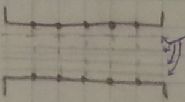
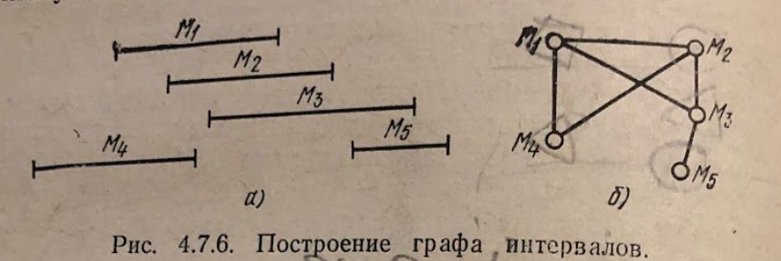
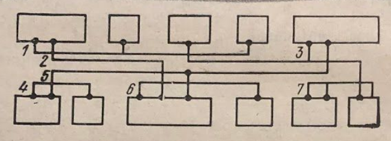
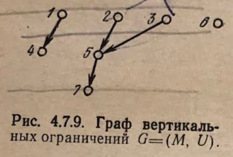
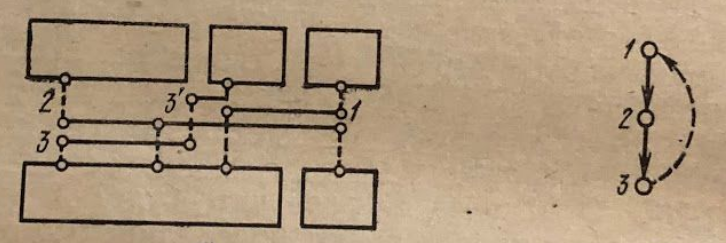
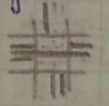

___
# Вопрос 20: Методы трассировки соединений внутри канала.
___

Одна из основных задач трассировка соединений внутри канала - выделение из множества соединений, отнесенных к каналу, минимального числа $$ h $$ подмножеств отрезков, каждое из которых может быть назначено на одну магистраль канала.

Магистрали - осевые линии, по которым проходят трассы.

Если пропускная способность $$ \gamma $$ канала задана, то должно быть выполнено условие $$ h \leq \gamma $$.

Пусть дано множество отрезков $$ S = \{ M_1, M_2, ..., M_n \} $$, отнесенных к этому каналу: $$ M_i = [ x^i_1, x^i_2 ], i = 1, 2, ..., n. $$ Два отрезка не могут быть помещены на одну магистраль, если они пересекаются $$ M_i \cap M_j \neq \varnothing $$

### Граф интервалов

Графом интервалов $$ G(S) $$ множества $$ S $$ называюется граф, вершинами которого являются интервалы $$ M_i(i=1, 2, ..., n) $$, а ребра соответствуют пересечению интервалов $$ M_i $$ и $$ M_j $$.

Таким образом задача оптимального использования магистралей формулируется, как задача получения минимальной раскраски вершин графа.

**Алгоритм:**

1.  Упорядочить интервалы множества $$ S $$ по левым концам: $$ M_1, M_2, ..., M_n $$ ( $$ M_i < M_j $$, если $$ x^i_1 < x^j_i $$ )

2.  После раскраски $$ k < n $$ вершин $$ M_i (i=1, 2, .., k) $$ вершину $$ M_{k+1} $$ окрасить первой по порядку краской, которой не окрашены смежные с ней вершины из множества $$ \{ M_i, i=1, 2, .., k \} $$

### Граф горизонтальных ограничений (ГГО)

ГГО представляет собой неориентированный граф $$ G = (M, W) $$, вершинами которого являются горизонтальные отрезки цепей $$ M_i $$, а наличие дуги $$ w = (M_i, M_j) $$ говорит о невозможности разместить элементы на одной магистрали $$ M_i \cap M_j \neq \varnothing $$.

### Граф вертикальных ограничений (ГВО)

Рассмотрим более общую задачу, когда минимизация числа горизонтальных связей осуществляется с учетом вертикальных связей между каналами.

Будем считать, что горизонтальные отрезки соединений располагаются в слое металлизации, а вертикальные отрезки (подходы к выводам ячеек) в слое диффузии.

При распределении горизонтальных отрезков необходимо следить за тем, чтобы вертикальные отрезки, находящиеся в одном столбце, не перекрывались друг с другом. Зададим данные ограничения с помощью ориентированного графа $$ G = (M, U) $$, вершинами которого являются горизонтальные отрезки цепей, а наличие дуги $$ u = (M_i, M_j) $$ означает, что отрезок $$ M_i $$ расположен на магистрали, находящейся над магистралью отрезка $$ M_j $$.

В случае, если ГВО содержит циклы, может потребоваться несколько горизонтальных отрезков.

Таким образом задача состоит в минимизации числа используемых магистралей при соблюдении порядка расположения горизонтальных отрезков цепей.

**Алгоритм:**

1.  Упорядочить множество горизонтальных отрезков $$ S = (M_1, M_2, ..., M_n) $$ по левым концам.
2.  Применить ранее описанный алгоритм раскраски графа интервалов $$ G(S) $$ с одним дополнением: при назначении цвета для очередной вершины $$ M_{k+1} $$ проверяется не только смежность ее с вершинами из множества $$ R_k = \{ M_i, i = 1, 2, ..., k \} $$, но и отношение порядка в графе вертикальных ограничений $$ G = (M, U) $$. Иными словами, пусть $$ l(M_i) $$ - номер магистрали для отрезка $$ M_i $$. Тогда:

$$
L_k = \{ M_i : M_i \in R_k, M_i \cap M_{k+1} = \varnothing \},
$$

$$
T_k = \{ M_i : M_i \in R_k, (M_i, M_{k+1}) \in U \in G(M,U) \}
$$

$$
l(M_{k+1}) = \min_{M_i \in R_k \setminus L_k} l(M_i) > \max_{M_i \in T_k} l(M_i)
$$

### Решение проблемы перекрестков

Участки, занятые перекрестком, не рассматриваются:
*   Соединения, меняющие направление, доводятся до границы перекрестка.
*   Соединения, **не** меняющие направления, проходят напрямую сквозь перекресток.
*   Перекресток рассматривается отдельным алгоритмом (напр. волновым)
