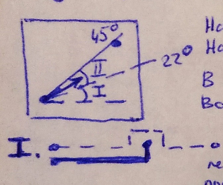
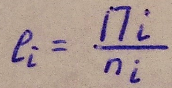
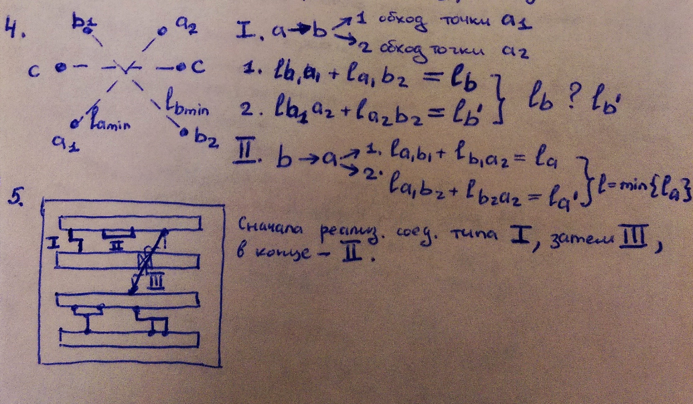

___
# Вопрос 21: Методы определения порядка трассировки соединений.
___
## Методы

#### 1. Ранжирование соединений по длинне

- начиная с самых коротких
- начиная с самых длинных

В каждом случае индивидуально.

#### 2.Учет вектора направления соединения по отношению к основному направлению проводников в одном слое

На один слой -> вектор с углом 0-45

На другой слой -> 46-90

В первую очередь соединения из группы 1, во вторую - соединения из группы 2

(группа 1 в первую очередь т.к у этих соединений маленькая часть вертикальных соединений, которые мешают прокладке других соединений)

## Для многоконтактных соединений

Приведенная длинна li , i - номер соединения :  

где Пi - полупериметр min охватывающ. прем-ка, пi - число контактов цепи

Какие соединения реализовывать сначала - с max li или с min li - неоднозначно.

При большом Пi - сильно разветвлено дерево соединений

