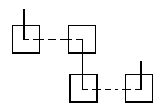
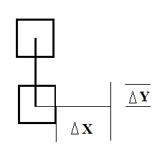
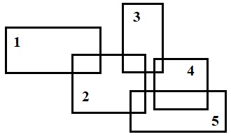
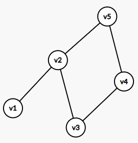
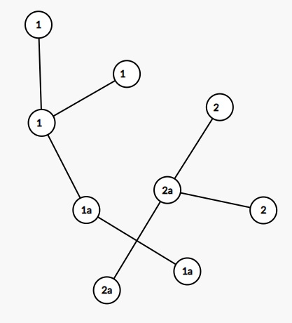

___
# Вопрос 22: Методы распределения соединений по слоям
___

**1. Расслоение до трассировки**

1. Части соединений находятся в разных слоях, каждый изгиб  - переход между слоями.

Большое количество переходов можно уменьшить, задав $$ |Delta x|$$ и  $$ |Delta y|$$.
Если участок соединения меньше $$ |Delta x|$$ и  $$ |Delta y|$$ => он остаётся в одном слое:

2. Если определены координаты элементов, то можно определить потенциально "проблемные" соединения. 
Для каждой цепи строится минимальный охватывающий прямоугольник. На рисунке ниже нарисованы прямоугольники для разных комплексов цепей.

Два комплекса $$ v_i$$ и $$ v_j$$ называются пересекающимися, если пересечение соответствующих прямоугольников не является пустым.
При пересечении прямоугольников возникает конфликт. Для разрешения конфликта строят граф пересечений, в котором каждая вершина - это минимальный охватывающий прямоугольник, а ребро между вершинами обозначает конфликт между прямоугольниками.
Ниже приведён пример графа для приведённого примера прямоугольников. 

3. Далее решаем задачу раскраски графа в зависимости от того задано число слоёв (красок) или нет.

Если число слоёв не задано => число красок бесконечно.

Если число  слоёв задано => число красок = число слоёв.

Число рёбер, связывающих вершины одного цвета, должно быть минимальным.

Если полностью разнесли по множествам (слоям) несмежных элементов, то минимизируем рёбра (число смежных элементов).

Можно решать задачу порядка трассровки, для этого в первую очередь рассматриваются вершины с максимальным числом рёбер (конфликтов).

Можно ввести вес ребра - площадь пересечения минимальных охватывающих прямоугольников.

**2. Расслоение после трассировки**

1. Предварительная трассировка (совмещённая, т.е. всё реализуется на одном слое, но допускается пересечение одним соединением другого)

2. Разнесение по слоям (перенос фрагментов соединений на другие слои)

3. Послойная трассировка

**Алгоритм предварительной трассировки**

Строим минимальное связывающее дерево (минимальная сумма длин рёбер):

При построении графа выделяют не всё соединение, а только его части, которые мешают прокладки соединений(1a---2a).
Далее осуществляется раскраска графа.

**Алгоритм раскраски графа**

1. Произвольной вершине $$ v_1$$ графа G присваивается цвет 1.
2. Если вершины $$ v_1, v_2,..., v_i$$ раскрашены l цветами 1,2,...,l и l<=i, то новой произвольно взятой вершине 
$$ v_i+1$$ припишем минимальный цвет, не использованный при раскраски смежных вершин.

