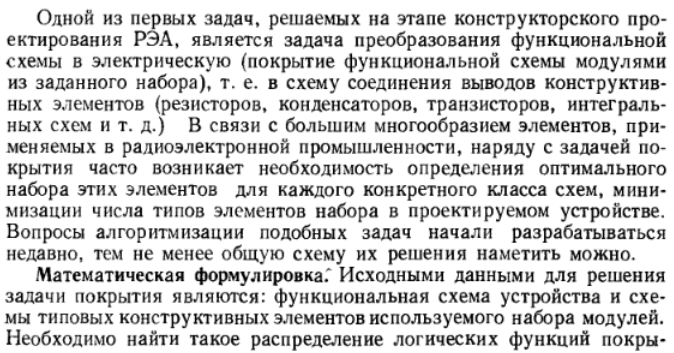
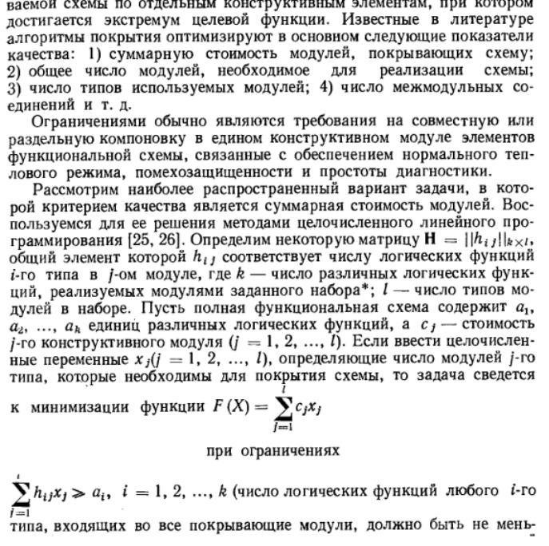
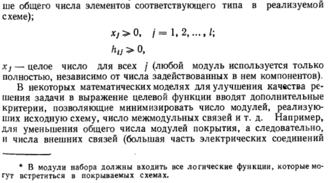
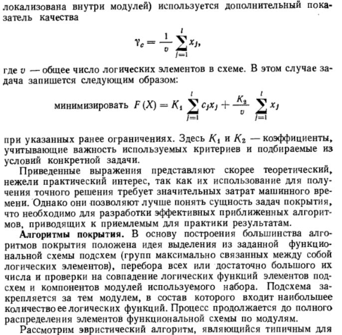
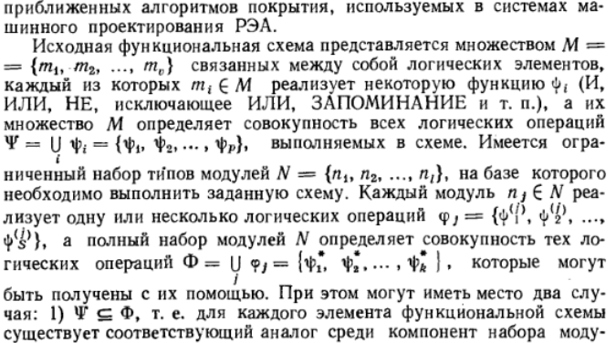
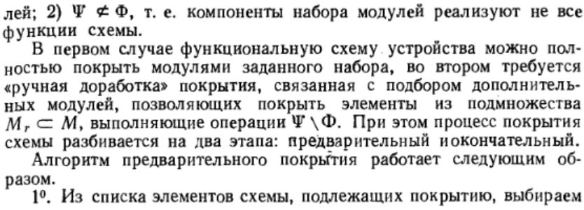
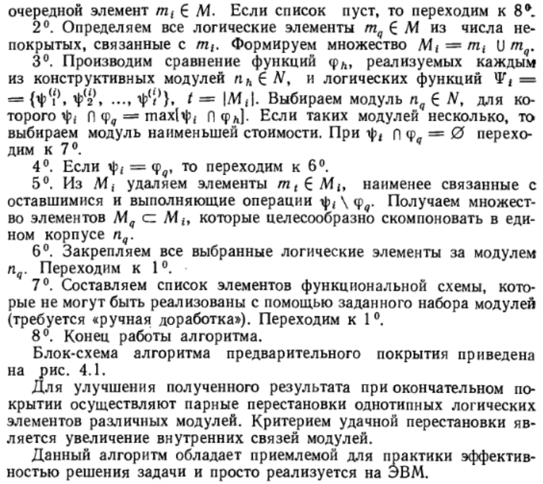
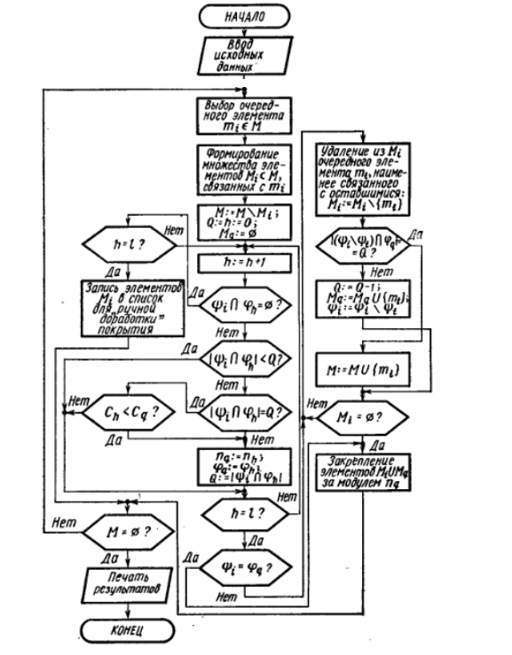

___
# Вопрос 23: Методы покрытия схем модулями из заданного набора
___

## Расшифровка записи на диктафоне

В основе метода лежит подход, когда любой логический элемент в логической схеме покрывается только такой же логической функцией, имеющейся в модуле (иными словами, в микросхеме). 

Для решения задачи применяется примитивный алгоритм. 

Выбираем некое ядро, добавляем его в список. Добавляем в список смежные ему.  

Если в модуле нет логической функции, которая соответствует элементу в сформированном подмножестве, то этот элемент удаляется из подмножества, потому что мы его не можем покрыть. 

Если все  элементы в схеме можно покрыть, но в наборе меньше элементов, поэтому некоторые элементы нужно удалить из списка. В этом случае нужно удалить наиболее слабосвязянные элементы, которые нельзя покрыть 

## Инфа откуда-то

