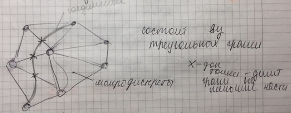

___
# Вопрос 24: Метод гибкой трассировки
___
 
Лежит в основе трассировки в Topor.

**Базовая идея**
Основан на канальном методе, отличается от него особой моделью монтажного поля (треугольная решётка, представляет из себя набор треугольных граней).
 
Рёбра граней задают пропускную способность, грани могут быть разные по размеру, из чего следует разная скорость построения волны.

**Особый случай**: грань с тупым углом.
 Для избежания непредвиденных ситуаций необходимо вводить метрические ограничения (обычно метрическим ограничением является высота или медиана треугольника).

$$ I.$$ Макротрассировка

Распределяем соединения по граням(каналам), если задача решена, то переходим к следующему этапу.
 Канал - набор треугольных граней.
$$ II.$$ Микротрассировка

 Если ребро пересекает несколько соединений, то распределяем равномерно, при этом получаем доп. точки, которые делят грани на меньшие части, соединяем их.
 Раньше при таких соединениях получалась ломанная, поскольку при реализации не хватало вычислительных способностей, на данный момент при таком методе в итоге получается плавная линия (пример: система topor).
 
 **Недостаток**: не можем учитывать реальные размеры контактных площадок.
 
 