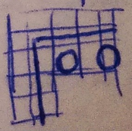
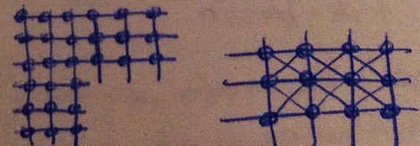
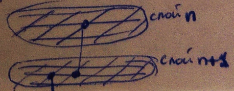
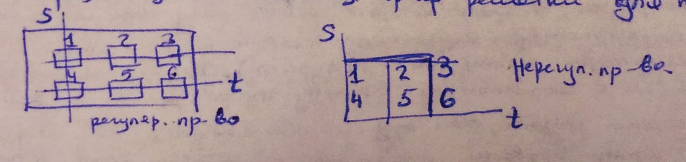
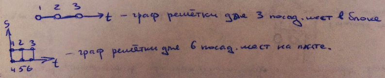

___
# Вопрос 3: Модели монтажных полей в задачах автоматизированного конструирования.
___

**Монтажное пространство** - метрическое пространство, в котором устанавливаются, входящие в него типовые конструкции предыдущих уровней (микросхемы, разьемы, соединители, платы и ...), и выполняются электрические соединения выводов. Модель монтажного пространства отображает метрические параметры и топологические свойства конструкции.

**Метрическими** параметрами могут быть:
* габаритные размеры зон монтажа
* допустимая ширина проводников и зазора между ними
* размеры внешних монтажным площадок
* шаг установки и размеры модулей
* координаты и размеры полей их контактов

**Топологические параметры** - это следующие числа:
* слоев монтажной платы
* переходов со слоя на слой
* замкнутых областей, запрещенных для прокладки соединений
* ограничений на взаимное расположение соединений в монтажной области и на количество монтажных проводов, проводимых к первому выводу.

В качестве математической модели монтажного пространства используется неориентированный топологический граф (граф решетки). Плоскость монтажного пространства разбивается на элементарные площадки, стороны которых равны шагу прокладки проводника по соответствующему направлению (для печатного монтажа элементарные площадки квадратные). Каждой элементарной площадке ставят в соответствии вершину графа решетки. Две вершины соединены ребром, если между соответствующими элементарными площадками можно провести соединение с учетом метрических и топологических параметров типовых конструкций, устанавливаемых в данное монтажное пространство.

Модель монтажного пространства может быть представлен фрагментом верхнего слоя печатной платы:

Или фрагментов с ортогональным монтажом при запрещении проведения проводников под микросхемами:

Если проводники размещены проводом под углом 45, то каждой вершине может быть инцедентно 8 ребер.

Фрагмент математической модели монтажного пространства многослойной печатной платы описывает вертикальные ребра, интерпретирующие межслойные переходы:

Из множества вершин этого графа можно выделить следующие подмножества:
* вершины, сопоставленные с контактными площадками выводов модулей (вершины обозначены кружками);
* вершины, представляющие внешние выводы типовой конструкции;
* вершины, интерпретирующие контактные площадки межслойных переходов (вершины обозначены кружками);

В случае выполнения соединений монтажными проводами в любом направлении вершины графа решетки сопоставляют с выводами конструктивного элемента (микросхемы, разьемы, соединители, платы и ...). Варианты различных соединений представляются полным подграфом, построенным на этих вершинах.

Для регулярного монтажного пространства в качестве модели поля размещения используется граф решетки для платы:

какая то дичь

