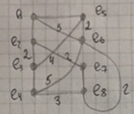
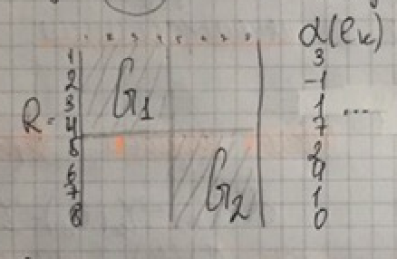
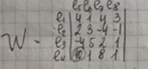

___
# Вопрос 6: Итерационные методы компоновки узлов
___

Для выполнения необходимо иметь начальную компоновку (хотя бы 2 куска). Из 1 куска выбирается 1 или нескольно вершин графа и затем выбирается и или несколько вершин из другого куска. После выбора производится попытка обмена выбранных вершин между кусками. Если попытка показала, что значение критерия улучшается, то выбиранные вершины меняются. Затем этот процесс повторяется.

1. Начальное решение может быть получено: случайным образом, с помощью проектировщика, с помощью простого алгоритма (например последовательный).
2. Число итераций заранее задано. Если $$ F_i - F_{i+1} $$ меньше какого-то значения, то итерационный процесс заканчивается.

Если элементы в перестановки учавствуют парами - это алгоритм попарных перестановок. Если группами - это алгоритм групповых перестановок. В отличии от групповых перестановок, алгоритм парных перестановок не всегда находит глобавльный минимум (лучшее решение).

## Итерационный алгоритм улучшения начальной компоновки (парные перестановки)

Число связности вершины – $$ a(e_k) = r_{k1}(G_j) - r_{k2}(G_i) $$ , где $$ r_{k1}(G_j) $$ - число ребер, связывающих вершину $$ e_k $$ с вершинами $$ G_j $$, причем $$ e_k $$ принадлежит $$ G_i $$; $$ r_{k2}(G_i) $$ - число ребер, связывающих вершину $$ e_k $$ с вершинами $$ G_i $$.

Изменение числа межузловых соединений:

$$ \Delta K_{xy} = a(e_x) + a(e_y) - 2*r_{xy} $$
где $$ r_{xy} $$ - число межузловых соединений между $$ e_x $$ и $$ e_y $$.

Пусть есть некоторый граф вида:

Разбиваем граф на 2 куска с числов вершин в кусках 4. Т.е. начальное решение получаем случайно.

1. Считаем числа связности.
2. Строим вспомогательную матрицу

где $$ w_{xy} = \Delta K_{xy} $$, $$ e_x $$ принадлежит $$ G_1 $$, $$ e_y $$ принадлежит $$ G_2 $$

3. В матрице W находим максимальный положительный элемент матрицы. Этот элемент отражает пару переставляемых вершин. Переставляем $$ e_4 $$ и $$ e_5 $$. Повторяем алгоритм.

У итерационного алгоритма есть еще 2 модификации:

* Итерационный алгоритм улучшения с последовательным выделением кусков.
* Попарное деление графа схемы на куски.

Но он, вроде как, не давал их на лекции, так что хз, что с ними делать.