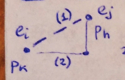
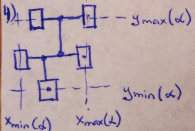

___
# Вопрос 7: Этап размещения элементов на монтажном поле (Цели, критерии, ограничения).
___

**Цель**: определить местоположения элементов внутри конструктивного узла.

**Монтажное поле** - часть платы, в пределах которой возможна установка элементов.

**Задачи размещения**, следующие:
1. Размещение в фиксированное позиции, как правило, для размещения одногабаритных элементов.
2. Размещение на непрерывном монтажном поле, как правило, для размещения разногабаритных элементов.

**Критерии размещения**:
1. Создание наилучших условий для последующей трассировки;
2. Минимум суммарной взвешенной длины соединений. Элементы ближе друг к другу => меньше суммарная взвешенная длина соединений (если нет весов => минимальная сумма длин соединений => снижение уровней задержек);
3. Минимум числа наидлиннейших связей. Длинные соединения => большое число пересечений, занимает много места;
4. Минимум числа изгибов соединений (минимум переходов со слоя на слой). Любой изгиб => переход => потери площади, заведомо слабое место;
5. Равномерность распределения соединений по участкам монтажного поля.

**Ограничения**
1. Метрические параметры элементов;
2. Топологические параметры (число слоев, переходов между слоями);

На данном этапе размещения длина считается приближенно и длина соединений приравнивается к расстоянию между позициями элементов:

Для простого двухконтактного соединения:

1. $$ d_{p_kp_h} = \sqrt{(x_k - x_h)^2 + (y_k - y_h)^2} $$;
2. $$ d_{kh} = |x_k - x_h| + |y_k - y_h| $$;
3. $$ d_{kh} = (x_k - x_h)^s + (y_k - y_h)^s, s = 2 $$

Для другого соединения:

$$ d_{U_\alpha} = |x_{max}(\alpha) - x_{min}(\alpha)| + |y_{max}(\alpha) - y_{min}(\alpha)| $$