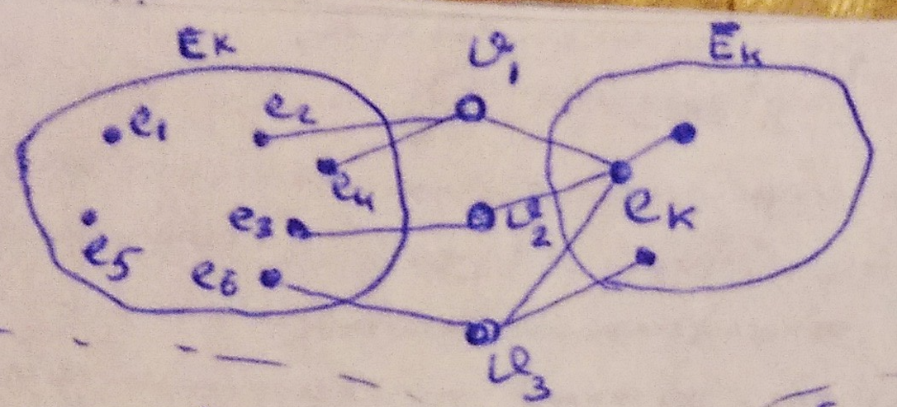
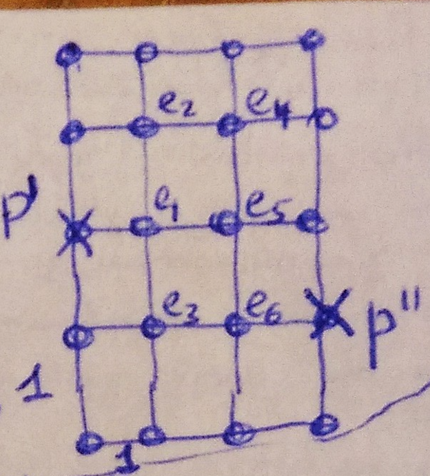
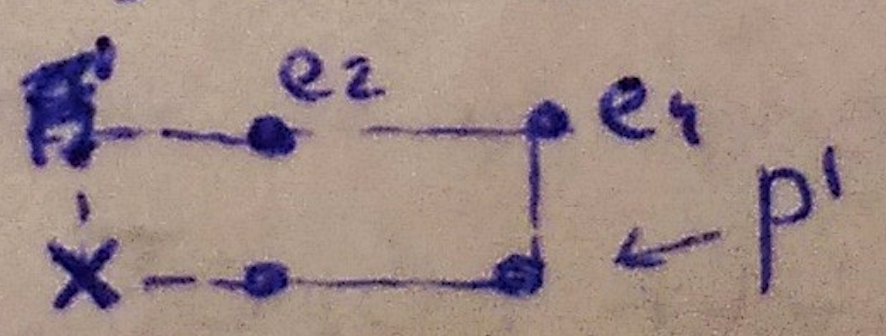

___
# Вопрос 8: Последовательные методы размещения элементов
___

## Рассмотрим размещение в фиксированные позиции

По определённому правилу определяется очередной размещаемый элемент, затем, по определённому правилу, для элемента выбирается позиция, и выбранный элемент закрепляется за за выбранной позицией окончательно. Если нет изначально установленных дискретных элементов, то алгоритм должен содержать особое правило для первого элемента и для позиции первого элемента.

### Набор правил:

Правило выбора очередного размещаемого элемента (k-й шаг):
* $$ E_k $$ – размещённые элементы;
* $$ \overline{E_k} $$ – не размещённые элементы;
* $$ p_k $$ – занятые позиции;
* $$ \overline{p_k} $$ – незанятые позиции;
* $$ e_k $$ – очередной размещаемый элемент;

1. Правило 1
В качестве очередного размещаемого элемента $$ e_k $$ выбирается элемент из $$ \overline{E_k} $$, для которого $$ c_k = r_{kj} $$, где $$ e_j \in E_k \rightarrow max $$
2. Правило 2
Из $$ \overline{E_k} $$ выбирается $$ c_k  = max \sum_{j}^{} r_{kj} $$, $$ e_j \in E_k $$.
Если элементов несколько, смотрим, у кого меньше связей с не размещёнными элементами.
Если сумма рёбер нескольких элементов одинакова, то считать для них $$ \alpha $$ $$ \rightarrow $$ символ связаности (ниже).
3. Правило 3
В качестве очередного $$ e_k $$ выбирается такой элемент из $$ \overline{E_k} $$, что $$ c_k = \sum_{j}^{} r_{kj} - \sum_{\alpha}^{} r_{k\alpha} $$, где $$ e_j \in E_k, e_{\alpha} \in \overline{E_k} $$
4. Правило 4
$$ c_k = \frac{\sum_{j}^{} r_{kj} }{\rho(e_k)} $$, вес ребра: $$ \gamma = \frac{2}{\rho(\vartheta_i)} $$

## Правило выбора позиций
Критерий - $$ min \sum_{}^{} $$ длины соединений.
Определение начального значения критерия, по которому работаем.

Стоит рассматривать позиции, ближайшие к занятым.

1. В качестве позиции для очередного размещаемого элемента выбирается позиция $$ p_i^* $$ из числа свободных, при установке в которую длина, т.е. критерий, стремится к минимуму.
$$ L = \sum_{j}^{} r_{kj} d_{p_i^j p_j} $$, где $$ e_j \in E_k $$, т.е. считаем приращение суммарной длины соединений

Пример: предположим, что есть некое подмножество элементов $$ E_k $$ (несколько элементов) и есть $$ \overline{E_k} $$.

2. В качестве  позиций очередного размещаемого элемента выбирается та позиция из числа свободных, для которой функционал $$ F = \sum_{s}^{} d_{i^*}^s, s \in I_{kj}, e_j \in E_k \rightarrow min $$
$$ I_{kj} $$ – номера цепей (подмножества), связывающие элемент $$ e_k $$ с ранее размещёнными элементами схемы (суммирование идёт по всем цепям)
$$ d_{i^*}^s $$ – расстояние от рассматриваемой позиции $$ i $$ до ближайшего ранее размещённого элемента в цепи с номером $$ s $$:

$$ p' \Rightarrow d_{p'}^1 = 2; d_{p'}^2 = 2; d_{p'}^3 = 3 \Rightarrow F = 7 $$
$$ p'' \Rightarrow d_{p''}^1 = 3; d_{p''}^2 = 2; d_{p''}^3 = 1 \Rightarrow F = 6 $$ 

Следовательно, выбираем позицию 2.
Алгоритм Прима – последовательный алгоритм.

3. Правило выбора очередного $$ e_k $$ : в качестве позиции для $$ e_k $$ выбираем такую позицию, в которой сумма полупериметра
$$ F = \sum_{s}^{} \prod_{kj}^s \rightarrow min $$

4. Для выбора позиций среди равноценных с точки зрения правил 1-3 можно воспользоваться следующим дополнительным правилом:
Выбирается позиция, лежащая ближе к "центру масс"  – точке, имеющей координаты: $$ x_{cm} = \frac{ \sum_{j}^{} r_{kj} d_p(k) p(j) }{ \sum_{j}^{} r_{kj} }, y_{cm} = \frac{ \sum_{j}^{} r_{kj} d_p(k) p(j) }{ \sum_{j}^{} r_{kj} } $$

Если имеем заранее размещённые элементы, то в качестве первого размещаемого элемента берём элемент с max локальной степенью, т.е. элемент, который инцидентен наибольшему числу элементов. Позиция для данного элемента выбирается из тех, у которых сумма расстояний от неё до всех остальных стремится к минимуму.
