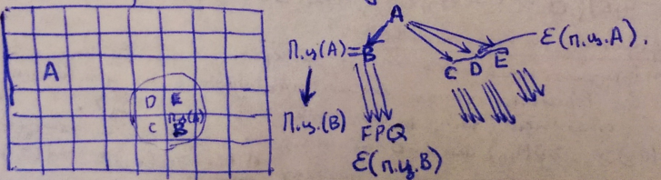

___
# Вопрос 9: Итерационные методы размещения элементов.
___

Алгоритм перестановок.
Необходимо некое начальное решение задачи.

1. Выбор элементов, учавствующих в перестановке.
2. Пробная перестановка и расчёт критерия.
3. Выбор лучшего варианта и перестановка.
4. Переход к следующей итерации или остановка.

$$ E_S $$ - подмножество элементов, имеющих общие рёбра с $$ e_i $$ или $$ e_j $$

$$ L_{nach} = \sum_{S} r_{is} d_{hp(s)} + \sum_{S} r_{js} d_{kp(s)} + r_{ij} d_{hk} + L_{ost} $$

$$ r_{ij} d_{hk} $$ - длина общих сеодинений

$$ L_{ost} $$ - длина остальных сокдинений

Теперь осуществим парную перестановку
$$ L_{new} = \sum_{S} r_{is} d_{kp(s)} + \sum_{S} r_{js} d_{hp(s)} + r_{ij} d_{hk} + L_{ost} $$

$$ \delta L_{ij} = L_{nach} - L_{new} = \sum_{S} (r_{is} - r_{js})(d_{kp(s)} - d_{hp(s)}) $$

$$ \delta L_{ij} > 0 $$ - удачная перестановка

Выбор кандидатов на перестановку:
1. random - случайный выбор элементов, лучше придумать какой-нибудь критерий выбора.
2. Сначала все вершины графа схемы ранжируются по убыванию локальных степеней (кол. рёбер подходящих к элементу) $$ \rho(e_1) >= \rho(e_2) >= ...>= \rho(e_n) $$ чем больше соединений подходит к элементу, тем важнее найти хорошее положение на МП (для 1-го соединения (элемента) (n-1) вариант, для 2-го (n-2) варианта, для 3-го (n-3), и тд, т.е. факториал всего, для выбранного элемента смотрим только одну перестановку),
или по d - суммарной длине соединений, подходящих к элементу $$ d(e_1) >= d(e_2) >= ...>= d(e_n) $$.
3. **Метод соседних перестановок**
$$  \frac{n(n-1)}{2} $$ - перестановок

Рассмотрим $$ M_{e_i} = \sum_{j} r_{ij} - \sum_{\alpha} r_{i\alpha} $$, где $$ e_i : x_j < x_i $$, левее $$ e_i $$, $$ e_{\alpha} : x_{\alpha} >= x_i $$ правее. Коэффициент насколько изменяется длина соединений элемента $$ e_i $$, если мы сдвинем его на 1 в одном из направлений.
Изменение длины $$ \delta L = M_{e_{i\leftarrow}} + M_{e_{\beta\rightarrow}} - 2r_{i\beta} $$, где $$ 2r_{i\beta} $$ - число общих рёбер у соответствующих элементов $$ e_i $$ и $$ e_{\beta} $$.

4. **Силонаправленный алгоритм релаксации (Алгоритм групповых перестановок)**
Можем ли определить положение элемента так, чтобы сумма длин к нему подходящих была минимальной? ДА.
  1) Минимизация длины проводников - Центр масс
  2) Введение сил притяжения (N9) - место, где $$ F_{ij} + P_{ij} = 0 \Rightarrow $$ находим точку, куда поместить A. ТЦ(А) - точка цепи А.
 

A - первичный элемент/напр., элемент с максимальным числом соединений.

Алгоритм:
  1) Выбор элемента А
  2) Находим ТЦ(А)
  3) Находим ПЦ(А) (Первичная позиция цепи (А), считалась когда все элементы находились в тех местах, которые соответствовали начальному размещению)
  4) ТЦ(В) $$ \Rightarrow $$ ПЦ(В)
  5) ТЦ(С) $$ \Rightarrow $$ ПЦ(С)
  и т.д.

5. **Алгоритм попарной релаксации**
  1) ПЦ(А) первичного элемента
  2) Окрестность ПЦ(А) $$ \rightarrow $$ eps(ПЦ(A))
  

  
  3) ПЦ(В), ПЦ(С), ПЦ(D), ПЦ(Е)
  4) Окрестности eps(ПЦ(В), eps(ПЦ(С)), eps(ПЦ(D)), eps(ПЦ(Е)). Каждый элемент должен только приблизиться к ПЦ! Если ПЦ(Е) попала в окрестность А, то меняем их местами. Наилучший обмен с тем элементом, чьё ПЦ ближе всего к позиции первичного элемента.
  Здесь мы стараемся не просматривать все возможные перестановки.

6. **Алгоритм Гото (объед. двух предыдущ. алг.)**

Конец, если последний элемент попадает в пустую позицию.

Рекомендации:
   - ограничить длины цепочки
   - ограничить eps тремя позициями
   - отсечение всех возможных ветвей (боковые ветви)
